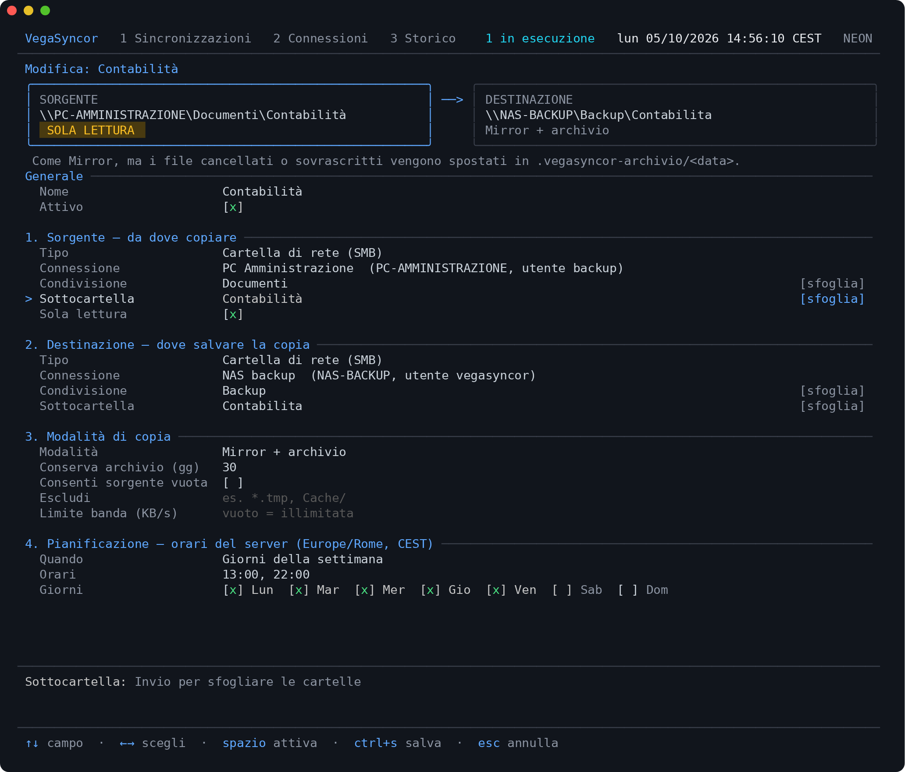
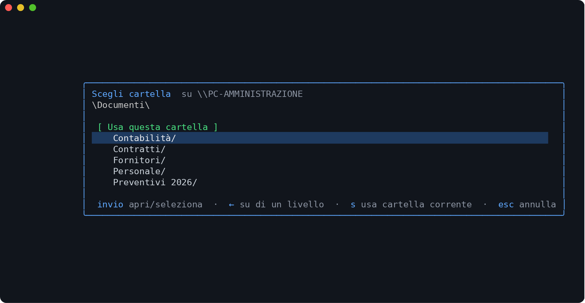
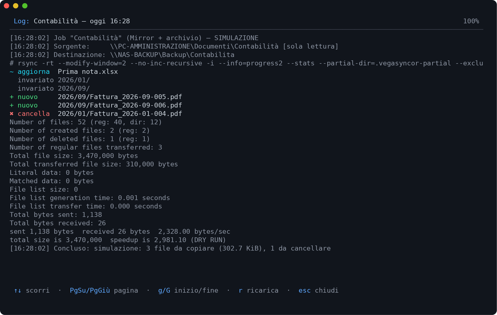
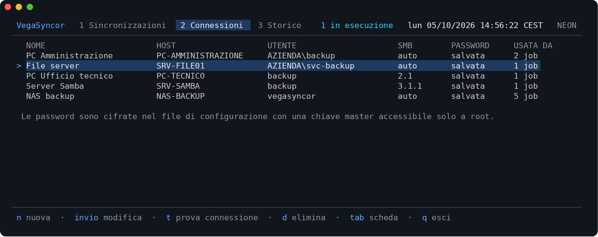
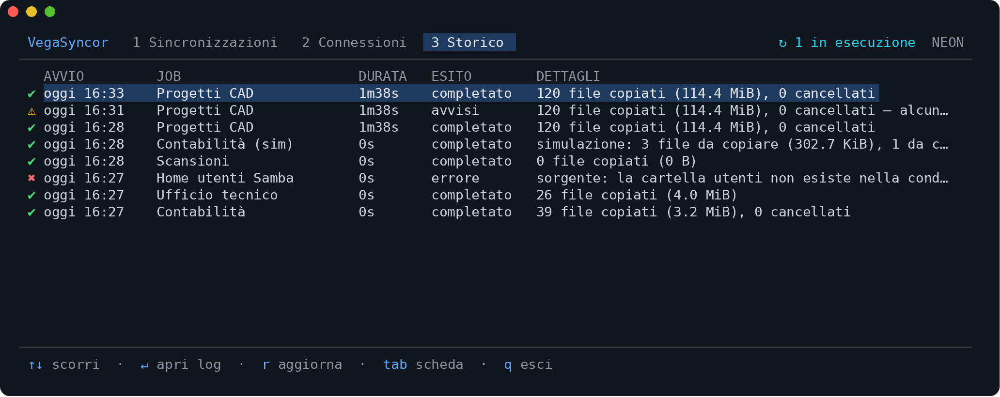

# VegaSyncor

Servizio per Linux (Debian/Ubuntu) che **sincronizza periodicamente cartelle di rete** (condivisioni
SMB/CIFS di PC e server Windows o di server Linux con Samba) **verso un server di backup**.
Si gestisce con un'interfaccia testuale (TUI) utilizzabile anche via SSH.


## Caratteristiche

- **Sorgente in sola lettura garantita dal kernel**: la condivisione sorgente viene montata con
  `mount.cifs -o ro` (le cartelle locali con un bind mount `ro`). Nessun errore di configurazione può
  modificare o cancellare file sulla sorgente.
- **Credenziali cifrate**: le password sono salvate cifrate (AES-256-GCM) in `/etc/vegasyncor/config.json`;
  la chiave master è in `/etc/vegasyncor/master.key` (solo root). Le password non compaiono mai nei
  processi, nei log o nella TUI: a `mount.cifs` vengono passate tramite un file temporaneo `0600` in
  `/run`, cancellato subito dopo il montaggio.
- **Tre modalità per ogni job**
  - *Mirror + archivio* (predefinita): la destinazione è identica alla sorgente, ma i file cancellati o
    sovrascritti vengono spostati in `.vegasyncor-archivio/AAAA-MM-GG_hhmmss/` nella destinazione e
    conservati per N giorni.
  - *Mirror*: copia esatta, i file cancellati alla sorgente vengono cancellati.
  - *Solo aggiunte*: non cancella mai nulla nella destinazione.
- **Destinazione** locale (disco del server, disco USB, NAS già montato) oppure condivisione SMB.
- **Pianificazione**: a intervalli (con fascia oraria e giorni opzionali), ogni giorno a uno o più orari,
  in giorni specifici della settimana, espressione cron, oppure solo manuale.
- **Simulazione**: mostra cosa verrebbe copiato e cancellato senza toccare nulla.
- **Protezione da sorgente vuota**: se la sorgente risulta vuota (es. condivisione svuotata o montaggio
  anomalo) un mirror viene bloccato, per non cancellare il backup.
- Copia incrementale con `rsync` (solo le differenze), limite di banda, esclusioni, storico e log
  dettagliati di ogni esecuzione.

## Screenshot

**Creazione/modifica di una sincronizzazione**: il riquadro in alto riassume sempre
*sorgente ━━▶ destinazione*, con l'indicazione di sola lettura.



**Scelta della cartella**: condivisioni e sottocartelle si sfogliano direttamente sul PC o server remoto.



**Simulazione**: prima di attivare un job si vede esattamente cosa verrebbe copiato, aggiornato o cancellato.



**Connessioni**: credenziali salvate e cifrate, riutilizzabili da più job.



**Storico**: esito di ogni esecuzione, con accesso al log dettagliato.



## Installazione

### Con il pacchetto .deb (consigliato)

```bash
sudo apt install ./vegasyncor_<versione>_amd64.deb
```

Il pacchetto installa le dipendenze (`rsync`, `cifs-utils`, consigliato `smbclient`), registra e
avvia il servizio `vegasyncor`.

### Con lo script

```bash
make build
sudo ./install.sh
```

### Dopo l'installazione

**Fare subito una copia di `/etc/vegasyncor/master.key`** in un luogo sicuro: senza la chiave le
password salvate non sono più decifrabili (andrebbero reinserite).

## Utilizzo

```bash
sudo vegasyncor              # apre la TUI
sudo vegasyncor status       # stato sintetico dei job
sudo vegasyncor check        # verifica che il sistema possa montare le condivisioni SMB
sudo vegasyncor run "Contabilità"      # avvia subito un job e ne mostra l'avanzamento
sudo vegasyncor dry-run "Contabilità"  # simulazione
journalctl -u vegasyncor -f  # log del servizio
```

Per usare la TUI senza `sudo` si può aggiungere l'utente al gruppo `vegasyncor`
(`sudo usermod -aG vegasyncor nomeutente`, poi rientrare). **Attenzione**: chi accede alla TUI può
configurare job che leggono qualsiasi cartella del server con privilegi di root; concedere il gruppo
solo agli amministratori.

### Primo job, passo per passo

1. Scheda **2 Connessioni** → `n`: nome, indirizzo del PC/server, utente, password (e dominio se il
   PC è in un dominio Windows). Con `t` si prova l'accesso e si vedono le condivisioni disponibili.
2. Scheda **1 Sincronizzazioni** → `n`:
   - **Sorgente**: scegliere la connessione, poi su *Condivisione* premere `Invio` per sceglierla
     dall'elenco e su *Sottocartella* `Invio` per sfogliare le cartelle.
   - **Destinazione**: ad esempio una cartella locale, sfogliabile con `Invio`.
   - **Modalità** e **Pianificazione**.
   - In alto un riquadro riassume sempre *SORGENTE ━━▶ DESTINAZIONE*.
   - `Ctrl+S` salva.
3. Selezionare il job e premere `s` per una **simulazione**, poi `l` per vedere l'elenco dei file
   che verrebbero copiati/cancellati.

### Mouse

Schede, comandi della barra in basso, righe degli elenchi, campi del form (caselle, scelte, giorni,
pulsanti `[sfoglia]`) e finestre sono cliccabili; la rotella scorre elenchi, form e log.
Un clic seleziona una riga, il doppio clic la apre.

Con il mouse attivo, per selezionare e copiare testo nel terminale tenere premuto **Shift** durante il
trascinamento. Per usare la TUI senza mouse: `vegasyncor --no-mouse` (oppure `VEGASYNCOR_NO_MOUSE=1`).

### Tasti principali

| Scheda | Tasti |
|---|---|
| Sincronizzazioni | `n` nuova · `Invio` modifica · `r` avvia ora · `s` simula · `x` interrompi · `p` sospendi/riattiva · `l` log · `d` elimina |
| Connessioni | `n` nuova · `Invio` modifica · `t` prova · `d` elimina |
| Storico | `Invio` apre il log dell'esecuzione · `r` aggiorna |
| Form | `↑↓`/`Tab` campo · `←→` scelta · `spazio` attiva/disattiva · `Invio` sfoglia · `Ctrl+S` salva · `Esc` annulla |

## Container (LXC, Proxmox, Docker)

VegaSyncor monta le condivisioni tramite il kernel (`mount.cifs`). Nei **container non privilegiati**
(ad esempio i container LXC predefiniti di Proxmox) il kernel non lo consente e ogni sincronizzazione
con cartelle di rete fallisce con `mount error(1): Operation not permitted`.

VegaSyncor riconosce la situazione: lo segnala durante l'installazione, in evidenza nella TUI, in
`vegasyncor status` e con `vegasyncor check`. Soluzioni:

- **Proxmox / LXC**: usare un container *privilegiato* con la funzionalità SMB/CIFS attiva. Proxmox
  non converte un container esistente: va fatto backup e ripristino come privilegiato, poi
  ```bash
  pct restore <NUOVO-ID> <backup>.tar.zst --unprivileged 0
  pct set <NUOVO-ID> --features mount=cifs
  ```
  (dall'interfaccia web: *Opzioni → Funzionalità → SMB/CIFS*).
- **Docker**: avviare il container con `--privileged` (oppure `--cap-add SYS_ADMIN --cap-add DAC_READ_SEARCH`).
- In alternativa una **macchina virtuale**, che non ha limitazioni.

## File e cartelle

| Percorso | Contenuto |
|---|---|
| `/etc/vegasyncor/config.json` | connessioni (password cifrate) e job |
| `/etc/vegasyncor/master.key` | chiave di cifratura delle password (**da salvare**) |
| `/var/lib/vegasyncor/history.json` | storico delle esecuzioni (ultime 100 per job) |
| `/var/lib/vegasyncor/logs/` | log dettagliato di ogni esecuzione |
| `/run/vegasyncor/vegasyncor.sock` | socket usato dalla TUI |
| `/run/vegasyncor/mnt/` | montaggi temporanei durante le copie |

## Note tecniche

- Sono preservate le date di modifica dei file; permessi e proprietari non vengono copiati (non hanno
  un equivalente affidabile tra Windows/SMB e Linux).
- Se un file è bloccato (es. aperto in Excel) il job termina **con avvisi** e il file viene copiato
  alla successiva esecuzione.
- Esclusi automaticamente: `Thumbs.db`, `desktop.ini`, `~$*` (file temporanei di Office), `.DS_Store`,
  `$RECYCLE.BIN`, `System Volume Information`.
- Più job possono girare in parallelo (`max_parallel` in `config.json`, predefinito 2). Se
  un'esecuzione pianificata trova il job precedente ancora in corso, viene saltata e annotata nello
  storico.
- In caso di errori di connessione con server vecchi impostare a mano la *Versione SMB* della
  connessione (es. 2.1 per Windows 7 / Server 2008 R2).

## Sviluppo

Richiede Go ≥ 1.24.

```bash
make test     # vet + test
make build    # bin/vegasyncor
make deb      # dist/vegasyncor_<versione>_{amd64,arm64}.deb
```

### Pubblicare una nuova versione

Le release vengono create automaticamente da GitHub Actions
([`.github/workflows/release.yml`](.github/workflows/release.yml)) all'invio di un tag:

```bash
git tag v0.2.0
git push origin v0.2.0
```

Il workflow esegue i test, compila i pacchetti `.deb` e i tarball (amd64 e arm64), calcola i
checksum e pubblica la release. Le note riportano l'elenco dei commit dal tag precedente.
I tag con suffisso (es. `v0.2.0-rc1`) diventano *pre-release*: non vengono installati dal comando
rapido, ma solo con `VEGASYNCOR_VERSION=0.2.0-rc1`.

Per preparare gli stessi file in locale: `packaging/build-release.sh 0.2.0` (risultato in `dist/release`).

Per provare senza root (nessun montaggio reale):

```bash
export VEGASYNCOR_DEV=1 VEGASYNCOR_CONFIG_DIR=/tmp/vs/etc VEGASYNCOR_STATE_DIR=/tmp/vs/state \
       VEGASYNCOR_RUNTIME_DIR=/tmp/vs/run VEGASYNCOR_DEV_SMB_ROOT=/tmp/vs/smb
./bin/vegasyncor daemon &
./bin/vegasyncor
```

In modalità sviluppo le condivisioni SMB sono simulate con cartelle locali:
`\\HOST\SHARE` corrisponde a `$VEGASYNCOR_DEV_SMB_ROOT/HOST/SHARE`
(es. `mkdir -p /tmp/vs/smb/PC-UFFICIO/Documenti`).

Struttura del codice:

| Pacchetto | Ruolo |
|---|---|
| `cmd/vegasyncor` | comandi (`daemon`, TUI, `status`, `run`) |
| `internal/daemon` | pianificatore, esecuzione job, API HTTP su socket Unix |
| `internal/tui` | interfaccia Bubble Tea |
| `internal/config` | modello dati, validazione, pianificazioni |
| `internal/secrets` | cifratura AES-256-GCM delle password |
| `internal/mount` | montaggi CIFS / bind in sola lettura, elenco condivisioni |
| `internal/syncer` | esecuzione rsync, avanzamento, archivio |
