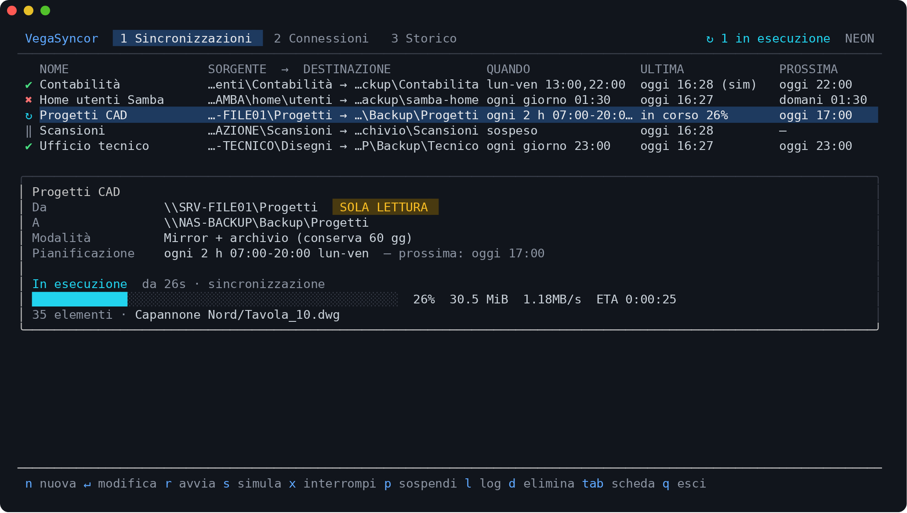
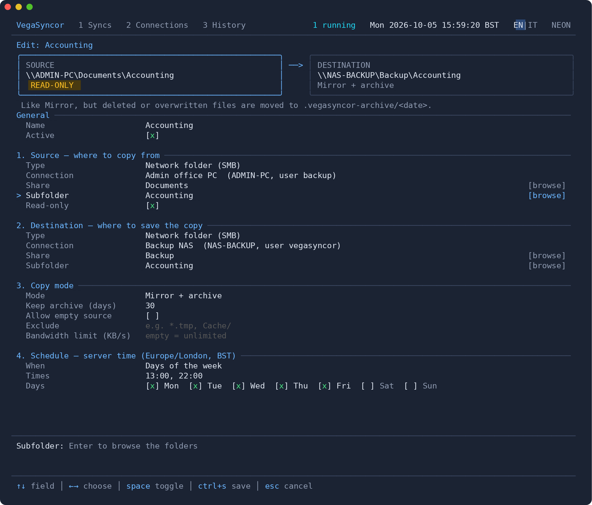
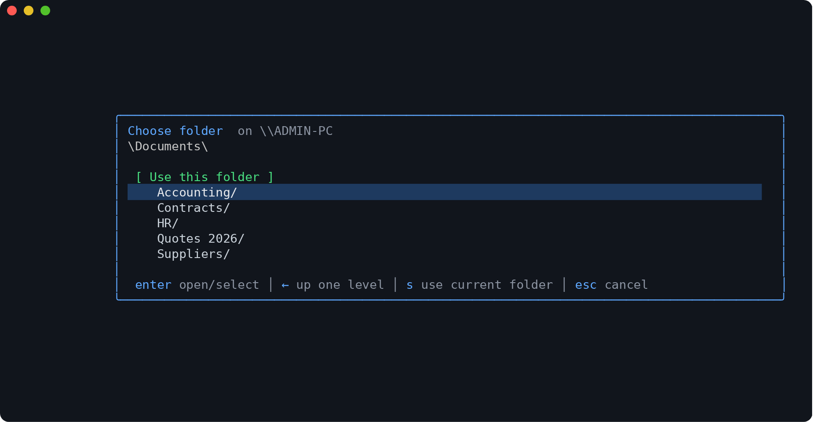
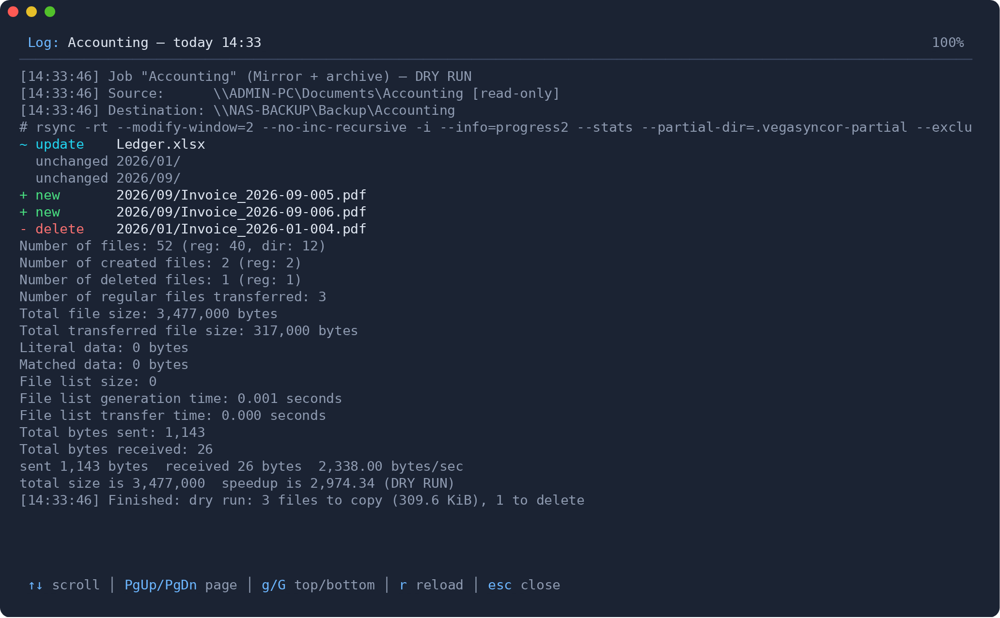
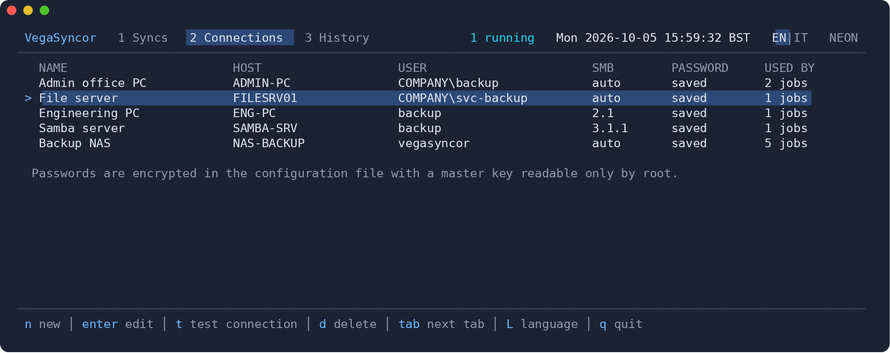
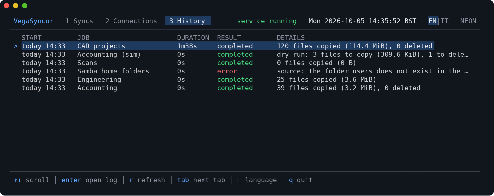

# VegaSyncor

A Linux service (Debian/Ubuntu) that **periodically syncs network folders** (SMB/CIFS shares of
Windows PCs and servers, or of Linux servers running Samba) **to a backup server**.
It is managed from a text-based interface (TUI) that also works over SSH.

The interface is available in **English** and **Italian**: switch with the `EN|IT` selector next to
the clock (or the `L` key).



## Features

- **Read-only source enforced by the kernel**: the source share is mounted with `mount.cifs -o ro`
  (local folders with a read-only bind mount). No configuration mistake can change or delete files
  on the source.
- **Encrypted credentials**: passwords are stored encrypted (AES-256-GCM) in
  `/etc/vegasyncor/config.json`; the master key is in `/etc/vegasyncor/master.key` (root only).
  Passwords never appear in processes, logs or the TUI: they are passed to `mount.cifs` through a
  temporary `0600` file in `/run`, deleted right after mounting.
- **Three modes per job**
  - *Mirror + archive* (default): the destination is identical to the source, but deleted or
    overwritten files are moved to `.vegasyncor-archive/YYYY-MM-DD_hhmmss/` in the destination and
    kept for N days.
  - *Mirror*: exact copy, files deleted at the source are deleted.
  - *Add only*: never deletes anything in the destination.
- **Destination**: local (server disk, USB disk, already mounted NAS) or an SMB share.
- **Scheduling**: at intervals (with optional time window and days), every day at one or more times,
  on specific days of the week, cron expression, or manual only. The server clock and time zone are
  always visible in the TUI.
- **Dry run**: shows what would be copied and deleted without touching anything.
- **Empty-source protection**: if the source turns out empty (e.g. emptied share or failed mount) a
  mirror is blocked, so the backup is not wiped.
- Incremental copy with `rsync` (differences only), bandwidth limit, exclusions, history and
  detailed log of every run.
- **Mouse support** in the TUI (tabs, commands, lists, form fields), alongside the keyboard.

## Screenshots

**Creating/editing a sync**: the box at the top always summarises *source ──> destination*, with
the read-only indicator; the bar at the bottom describes the active field.



**Choosing a folder**: shares and subfolders are browsed directly on the remote PC or server.



**Dry run**: before enabling a job you see exactly what would be copied, updated or deleted.



**Connections**: saved, encrypted credentials, reusable by several jobs.



**History**: outcome of every run, with access to the detailed log.



## Installation

### Quick install (Debian / Ubuntu)

```bash
curl -fsSL https://github.com/sabbakix/VegaSyncor/releases/latest/download/vegasyncor-install.sh | sudo sh
```

The script detects the architecture (amd64/arm64), downloads the `.deb` package from the latest
release, verifies its checksum, installs the dependencies (`rsync`, `cifs-utils`, `smbclient`) and
starts the `vegasyncor` service. Run it again to update.

### With the .deb package

```bash
sudo apt install ./vegasyncor_<version>_amd64.deb
```

### From source

```bash
make build
sudo ./install.sh
```

### After installing

**Make a copy of `/etc/vegasyncor/master.key`** in a safe place right away: without the key the saved
passwords can no longer be decrypted (they would have to be entered again).

## Usage

```bash
sudo vegasyncor                      # opens the TUI
sudo vegasyncor status               # short status of the jobs
sudo vegasyncor check                # checks that the system can mount SMB shares
sudo vegasyncor run "Accounting"     # runs a job now and shows its progress
sudo vegasyncor dry-run "Accounting" # dry run
journalctl -u vegasyncor -f          # service log
```

To use the TUI without `sudo`, add the user to the `vegasyncor` group
(`sudo usermod -aG vegasyncor username`, then log in again). **Warning**: whoever can use the TUI can
configure jobs that read any folder of the server with root privileges; grant the group to
administrators only.

### First job, step by step

1. Tab **2 Connections** → `n`: name, address of the PC/server, user, password (and domain if the PC
   is in a Windows domain). `t` tests the access and shows the available shares.
2. Tab **1 Syncs** → `n`:
   - **Source**: choose the connection, then press `Enter` on *Share* to pick it from the list and
     on *Subfolder* to browse the folders.
   - **Destination**: for example a local folder, also browsable with `Enter`.
   - **Mode** and **Schedule**.
   - The box at the top always summarises *SOURCE ──> DESTINATION*.
   - `Ctrl+S` saves.
3. Select the job and press `s` for a **dry run**, then `l` to see the list of files that would be
   copied/deleted.

### Language

The TUI and the service messages are available in English (default) and Italian. Switch from the
`EN|IT` selector at the top right, next to the clock, or with the `L` key. The choice is saved in the
service configuration, so it also applies to `vegasyncor status` / `check` and to the messages of new
runs (entries already in the history keep the language they were written in).
`VEGASYNCOR_LANG=en|it` forces a language for a single command or session.

### Mouse

Tabs, the commands of the bottom bar, list rows, form fields (check boxes, choices, days, `[browse]`
buttons), dialogs and the language selector are clickable; the wheel scrolls lists, forms and logs.
A click selects a row, a double click opens it.

With the mouse enabled, hold **Shift** while dragging to select and copy text in the terminal.
To use the TUI without the mouse: `vegasyncor --no-mouse` (or `VEGASYNCOR_NO_MOUSE=1`).

### Main keys

| Tab | Keys |
|---|---|
| Syncs | `n` new · `Enter` edit · `r` run now · `s` dry run · `x` stop · `p` pause/resume · `l` log · `d` delete |
| Connections | `n` new · `Enter` edit · `t` test · `d` delete |
| History | `Enter` opens the run log · `r` refresh |
| Form | `↑↓`/`Tab` field · `←→` choice · `Space` toggle · `Enter` browse · `Ctrl+S` save · `Esc` cancel |
| Everywhere | `1` `2` `3` / `Tab` switch tab · `L` language · `q` quit |

## Containers (LXC, Proxmox, Docker)

VegaSyncor mounts the shares through the kernel (`mount.cifs`). In **unprivileged containers** (for
example the default LXC containers of Proxmox) the kernel does not allow it, and every sync with
network folders fails with `mount error(1): Operation not permitted`.

VegaSyncor detects this: it reports it during installation, prominently in the TUI, in
`vegasyncor status` and with `vegasyncor check`. Solutions:

- **Proxmox / LXC**: use a *privileged* container with the SMB/CIFS feature enabled. Proxmox cannot
  convert an existing container: back it up and restore it as privileged on a storage that accepts
  containers (e.g. `local-lvm`), then enable the feature:
  ```bash
  pct restore <NEW-ID> <backup>.tar.zst --unprivileged 0 --storage local-lvm
  pct set <NEW-ID> --features mount=cifs
  ```
  (from the web interface: *Options → Features → SMB/CIFS*). If the container already had other
  features (e.g. `nesting=1`), list them together: `--features nesting=1,mount=cifs`.
- **Docker**: start the container with `--privileged` (or `--cap-add SYS_ADMIN --cap-add DAC_READ_SEARCH`).
- Alternatively, a **virtual machine**, which has no limitations.

## Files and folders

| Path | Contents |
|---|---|
| `/etc/vegasyncor/config.json` | connections (encrypted passwords), jobs and settings |
| `/etc/vegasyncor/master.key` | password encryption key (**back it up**) |
| `/var/lib/vegasyncor/history.json` | run history (last 100 per job) |
| `/var/lib/vegasyncor/logs/` | detailed log of every run |
| `/run/vegasyncor/vegasyncor.sock` | socket used by the TUI |
| `/run/vegasyncor/mnt/` | temporary mounts during copies |

## Technical notes

- File modification times are preserved; permissions and owners are not copied (they have no
  reliable equivalent between Windows/SMB and Linux).
- If a file is locked (e.g. open in Excel) the job ends **with warnings** and the file is copied on
  the next run.
- Automatically excluded: `Thumbs.db`, `desktop.ini`, `~$*` (Office temporary files), `.DS_Store`,
  `$RECYCLE.BIN`, `System Volume Information`.
- Several jobs can read the same share at the same time: each run mounts it on its own mount
  point. Destinations must not overlap, though: VegaSyncor refuses to save a job whose destination
  is the same folder as another job's (or inside it) when one of the two is a mirror, because each
  run would delete the other job's files. Two *Add only* jobs may share a destination.
- Several jobs can run in parallel (`max_parallel` in `config.json`, default 2). If a scheduled run
  finds the previous run of the same job still in progress, it is skipped and noted in the history.
- If the service stops abruptly during a copy (reboot, power loss), the run shows up in the history
  as *interrupted* after the restart.
- With old servers, if the connection fails, set the connection's *SMB version* manually
  (e.g. 2.1 for Windows 7 / Server 2008 R2).

## Development

Requires Go ≥ 1.24.

```bash
make test     # vet + tests
make build    # bin/vegasyncor
make deb      # dist/vegasyncor_<version>_{amd64,arm64}.deb
```

### Publishing a new version

Releases are created automatically by GitHub Actions
([`.github/workflows/release.yml`](.github/workflows/release.yml)) when a tag is pushed:

```bash
git tag v0.3.0
git push origin v0.3.0
```

The workflow runs the tests, builds the `.deb` packages and the tarballs (amd64 and arm64), computes
the checksums and publishes the release. The notes list the commits since the previous tag.
Tags with a suffix (e.g. `v0.3.0-rc1`) become *pre-releases*: they are not installed by the quick
install command, only with `VEGASYNCOR_VERSION=0.3.0-rc1`.

To build the same files locally: `packaging/build-release.sh 0.3.0` (output in `dist/release`).

### Trying it without root

No real mounts are made in development mode:

```bash
export VEGASYNCOR_DEV=1 VEGASYNCOR_CONFIG_DIR=/tmp/vs/etc VEGASYNCOR_STATE_DIR=/tmp/vs/state \
       VEGASYNCOR_RUNTIME_DIR=/tmp/vs/run VEGASYNCOR_DEV_SMB_ROOT=/tmp/vs/smb
./bin/vegasyncor daemon &
./bin/vegasyncor
```

SMB shares are simulated with local folders: `\\HOST\SHARE` maps to
`$VEGASYNCOR_DEV_SMB_ROOT/HOST/SHARE` (e.g. `mkdir -p /tmp/vs/smb/OFFICE-PC/Documents`).

### Translations

Texts are written in English in the code and wrapped with `T("...")` / `Tf("...", args)`.
Translations live in `internal/i18n`, one table per language keyed by the English text
(Italian: `internal/i18n/it_*.go`). A test (`go test ./internal/i18n`) scans the sources and fails if
a text has no translation, if a translation is no longer used, or if the format verbs (`%s`, `%d`, …)
differ. To add a language: add it to `Languages` and `catalogs` in `internal/i18n/i18n.go` and create
its table.

### Code layout

| Package | Role |
|---|---|
| `cmd/vegasyncor` | commands (`daemon`, TUI, `status`, `check`, `run`) |
| `internal/daemon` | scheduler, job execution, HTTP API over a Unix socket |
| `internal/tui` | Bubble Tea interface |
| `internal/config` | data model, validation, schedules |
| `internal/i18n` | translations (English → Italian) |
| `internal/secrets` | AES-256-GCM encryption of passwords |
| `internal/mount` | CIFS mounts / read-only binds, share listing, environment checks |
| `internal/syncer` | rsync execution, progress, archive |
